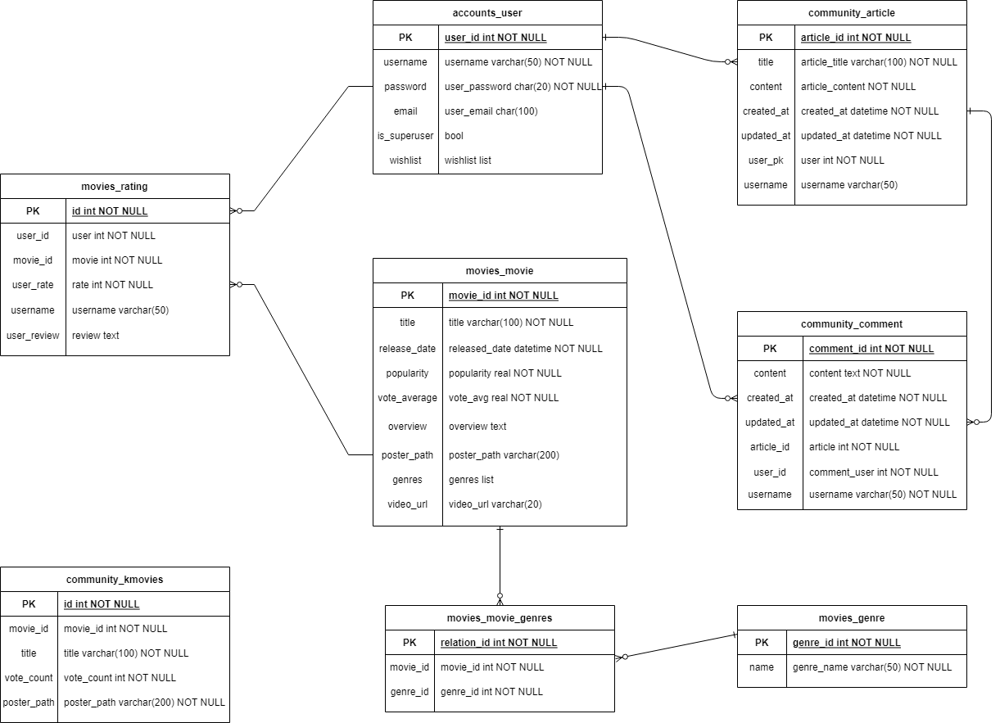
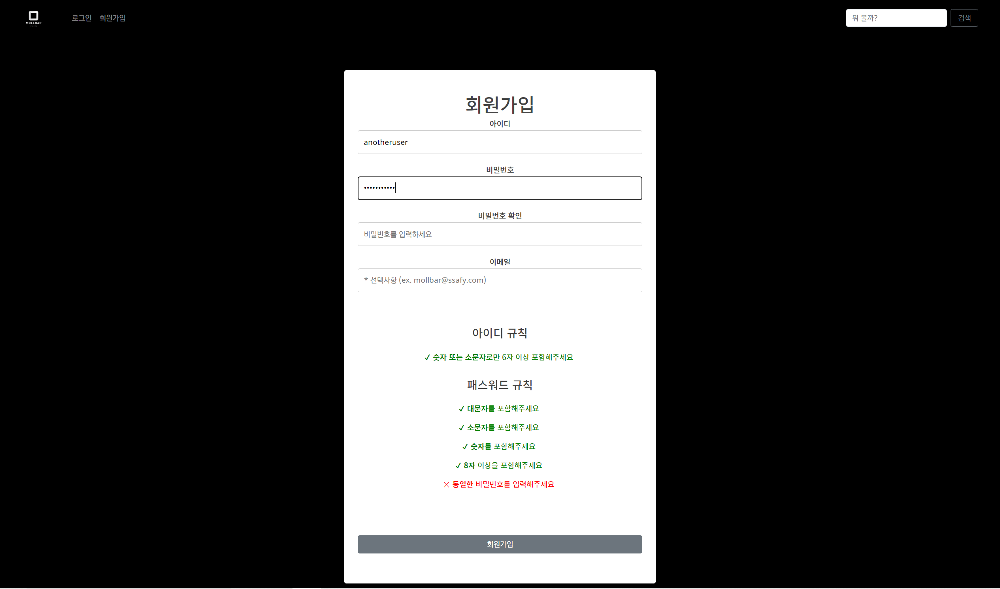
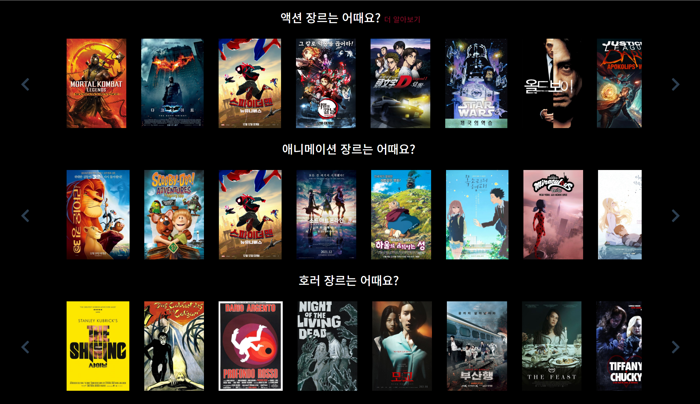
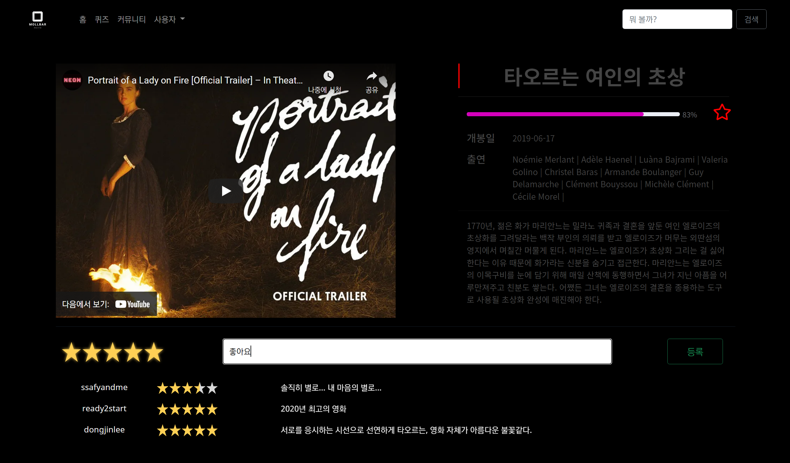
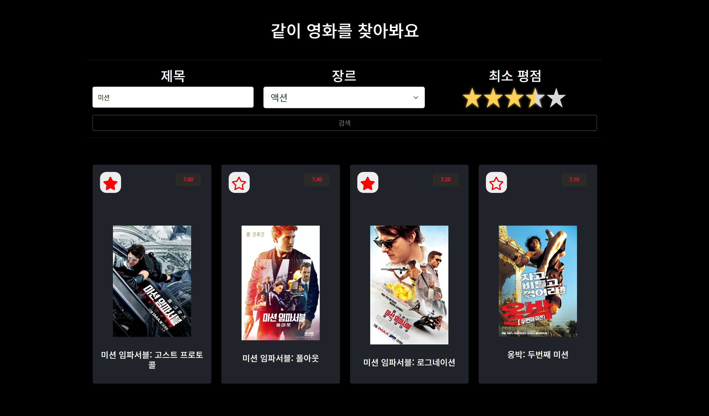
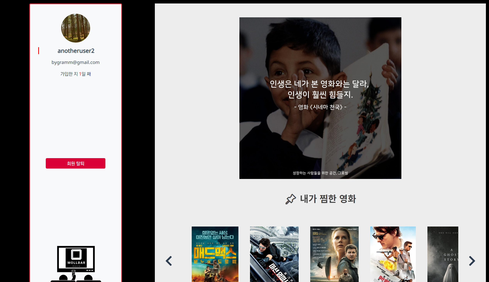
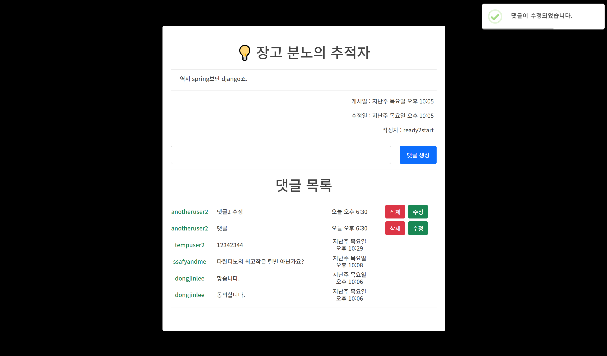
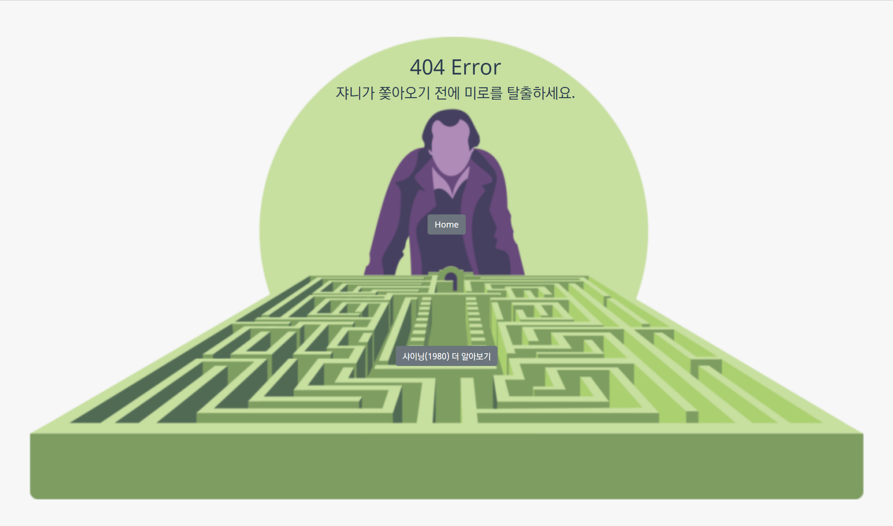
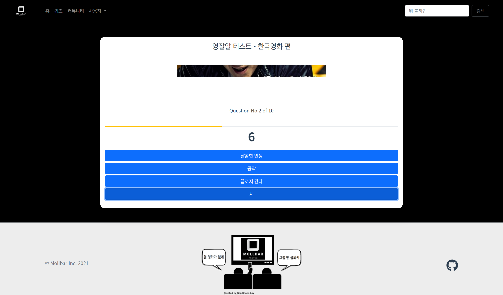

# Mollbar

> 몰 봐야 할 지 모르겠을 때 몰 봐야 할 지 알려주는 영화 커뮤니티 사이트

### 🗓 프로젝트 기간

- 2021.11.17 ~ 2021.11.25 (총 9일)

<br>

### 👨🏽‍🤝‍👨🏽 팀원 구성

<table>
  <tr>
    <td align="center"><a href="https://github.com/Mingdoo"><br /><sub><b>강민수 (Frontend)</b></sub></a><br />
    <td align="center"><a href="https://github.com/by-gramm"><br /><sub><b>이정환 (Backend)</b></sub></a><br /></td>
</tr>
</table>
<br>

### 🛠 기술 스택

- Frontend
  - `Vue.js` `Bootstrap-Vue`
- Backend
  - `Django Rest Framework` `db.sqlite3`

<br>

### 📊 ERD

<p align="center">
  
</p>

<br>

### 📌 구현 내용

1. Accounts

   - 회원가입 `#101`
   - 로그인 `#102`
   - 로그아웃 `#103`
   - 프로필 페이지 `#104`
   - 회원 탈퇴 `#105`

2. Admin

   - 관리자 페이지 `#201`

3. Movie

   - 영화 detail 페이지 `#301`
   - 영화 평점 등록 `#302`
   - 영화 평점 수정 `#303`
   - 영화 평점 삭제 `#304`
   - 필터링 검색 `#305`
   - 이번주 인기 영화 추천 `#306`
   - 장르별 영화 추천 `#307`
   - DB에 영화 등록 `#308`
   - 스크린샷 영화 퀴즈 `#309`

4. Community

   - 커뮤니티 게시글 조회 `#401`
   - 커뮤니티 게시글 생성 `#402`
   - 커뮤니티 게시글 수정 `#403`
   - 커뮤니티 게시글 삭제 `#404`
   - 커뮤니티 댓글 작성 `#405`
   - 커뮤니티 댓글 수정 `#406`
   - 커뮤니티 댓글 삭제 `#407`

5. UI/UX

   - BootstrapVue `#501`
   - 404 Error 페이지 `#502`

<br>

### 🖼 스크린샷

|    |            |
| :----------------------------------------: | :---------------------------------------------: |
|               `Signup Page`                |                   `Main Page`                   |
|    |  |
|               `Detail Page`                |                  `Search Page`                  |
|  |   |
|               `Detail Page`                |                `Community Page`                 |
|    |             |
|              `404 Error Page`              |                `Movie Quiz Page`                |

<br>

### 📝 기록

#### Backend 기록 모음

|no|title|link|
| :--: | :-----------: | :--: |
|1|TMDB API로 영화 데이터 가져오기|[LINK](https://velog.io/@ready2start/Mollbar-%ED%8A%B8%EB%9F%AC%EB%B8%94-%EC%8A%88%ED%8C%85-%EC%98%81%ED%99%94-%EB%8D%B0%EC%9D%B4%ED%84%B0-%EA%B0%80%EC%A0%B8%EC%98%A4%EA%B8%B0)|
|2|prefetch_related를 통한 성능 개선|[LINK](https://velog.io/@ready2start/Mollbar-02-prefetchrelated%EB%A5%BC-%ED%86%B5%ED%95%9C-%EC%84%B1%EB%8A%A5-%EA%B0%9C%EC%84%A0)|
|3|영화 평점 시스템 구현하기|[LINK](https://velog.io/@ready2start/Mollbar-%EC%98%81%ED%99%94-%ED%8F%89%EC%A0%90-%EC%8B%9C%EC%8A%A4%ED%85%9C-%EA%B5%AC%ED%98%84%ED%95%98%EA%B8%B0)|
|4|비밀번호 변경 with JWT|[LINK](https://velog.io/@ready2start/Mollbar-%ED%8A%B8%EB%9F%AC%EB%B8%94-%EC%8A%88%ED%8C%85-%EB%B9%84%EB%B0%80%EB%B2%88%ED%98%B8-%EB%B3%80%EA%B2%BD-with-JWT)|
|5|sqlite3에 리스트 필드 추가하기|[LINK](https://velog.io/@ready2start/Mollbar-sqlite3%EC%97%90-%EB%A6%AC%EC%8A%A4%ED%8A%B8-%ED%95%84%EB%93%9C-%EC%B6%94%EA%B0%80%ED%95%98%EA%B8%B0)|

<br>

### ✅ 느낀 점

- 강민수

```bash

```

- 이정환

```bash
- 9일 동안 잠을 줄여가며 열심히 만들었는데, 무사히 프로젝트를 끝마칠 수 있어서 좋았습니다. 
- 주어진 시간이 짧았기 때문에, 기능 하나하나에 집중하기보다는 에러 없이 매끄럽게 잘 동작하는 사이트를 만드는 것에 더 중점을 두었습니다. 그래서 처음 계획한 기능 중 소셜 로그인, 취향분석 시각화 등 구현하지 못한 기능들도 있지만, 필수적인 기능들이 매끄럽게 잘 동작하는 사이트를 만들 수 있었습니다.
- 이번 프로젝트를 하면서 배운 점 중 하나는 scalable한 코드의 중요성입니다. 프로젝트를 하면서 모델에 필드 하나를 추가하느라 DB 전체를 초기화하는 등 A에 준 변화가 B나 C에서 에러를 발생시키는 경우가 많았습니다. 그래서 구조를 확장하더라도 기존 코드에 최대한 영향을 주지 않는 확장 가능한 코드를 작성하기 위해 노력해야겠다고 생각했습니다.
```

------

### 장르 데이터 DB에 저장

```bash
python manage.py loaddata genre_data.json
```

### 영화 데이터 DB에 저장

- 반드시 장르 데이터를 먼저 저장한 후에 저장해야 한다.

```bash
python manage.py loaddata movie_data.json
```

### 영화 퀴즈 데이터 DB에 저장

```bash
python manage.py loaddata kmovie_data.json
```
